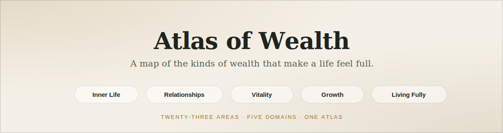

<p align="center">
  
</p>

<p align="center">
  <a href="https://github.com/TMFNK/how-to-be-simply-rich/actions/workflows/deploy.yml"></a>
  <a href="LICENSE"></a>
  
  
  <a href="https://tmfnk.github.io/how-to-be-simply-rich/"></a>
</p>

<p align="center"><strong><a href="https://tmfnk.github.io/how-to-be-simply-rich/">🌐 View the live atlas</a></strong></p>

A vibe-coded static atlas of non-financial wealth: 23 areas of life worth being rich in, grouped into 5 domains, each with a definition, a reason it matters, and a three-part daily practice.

The site treats richness as a landscape rather than a flat checklist. Instead of opening on a wall of equal-weight topics, the homepage groups the ideas into a few larger domains so visitors can browse the full map first and then choose one area to reflect on.

> Inspired by and based on [**How to Be Rich**](https://github.com/anvaka/how-to-be-rich) by Andrei Kashcha ([@anvaka](https://github.com/anvaka)) — same 23 wealth areas, same daily-practice philosophy. See [what's different](#whats-different-from-the-original) below.

## Contents

- [What the Site Does](#what-the-site-does)
- [Atlas Structure](#atlas-structure)
- [What's Different From the Original](#whats-different-from-the-original)
- [Quick Start](#quick-start)
- [Project Structure](#project-structure)
- [Editing Content](#editing-content)
- [Running Checks](#running-checks)
- [Contributing](#contributing)
- [License](#license)
- [Credits](#credits)

## What the Site Does

The homepage works as an atlas of five domains:

- Inner Life
- Relationships
- Vitality
- Growth
- Living Fully

Each domain links to a set of topics such as `time`, `love`, `health`, `wisdom`, or `adventure`. Every topic follows the same compact structure:

- a short definition
- why it matters
- three practice prompts: `Notice`, `Choose`, `Practice`
- a small set of reflection questions

## Atlas Structure

The current domain model is:

- `Inner Life`: mind, contentment, resilience, faith, wisdom
- `Relationships`: love, family, connection, empathy, kindness, community
- `Vitality`: health, time, blessings, gratitude
- `Growth`: knowledge, curiosity, creativity, purpose, growth
- `Living Fully`: adventure, experiences, happiness

## What's Different From the Original

This project started from [How to Be Rich](https://github.com/anvaka/how-to-be-rich) by Andrei Kashcha ([@anvaka](https://github.com/anvaka)) — an idea sparked by a TikTok video listing all the ways someone wanted to be rich. Since then it's diverged in a few ways:

- **Domain-grouped homepage.** The original homepage is a flat grid of 23 equal-weight cards. This atlas groups them into 5 domains (Inner Life, Relationships, Vitality, Growth, Living Fully) so you see the shape of the whole landscape before choosing one area.
- **One consistent topic structure.** Each original topic page hand-authored its own set of roughly 10 expandable "tip cards" plus a randomly rotating quote, and the structure varied page to page. Every topic here follows the same compact shape instead: a definition, why it matters, three practice prompts (`Notice` / `Choose` / `Practice`), and a small set of reflection questions.
- **Single source of truth for content.** The original duplicated its topic list across `index.html`'s inline script and a separate `richThings.js` — and the two had drifted out of sync (the original `richThings.js` is missing `faith`). This project keeps all topic and domain data in one typed module (`src/content.ts`), and a test (`content.test.ts`) enforces that every topic is complete and belongs to exactly one domain, so that kind of drift can't happen silently.
- **Typed build and test suite.** The original is plain static HTML/CSS with an inline `<script>` per page — no package manager, no tests, no CI. This project is a Vite + TypeScript build with a Vitest test suite (content integrity and routing) and a GitHub Actions workflow that runs tests before every deploy.
- **Single-page app.** The original ships 24 separate HTML files, each duplicating the page shell. This is a single-page app with hash routing (`#/`, `#/topic/<slug>`, `#/about`) built from shared view functions, so there's one shell instead of 24 copies of it.

To be clear, none of this makes the new version strictly "better" — the original's per-topic tip lists cover more ground per page. This atlas trades some of that breadth for consistency and easier maintenance.

## Quick Start

```bash
git clone https://github.com/TMFNK/how-to-be-simply-rich.git
cd how-to-be-simply-rich
npm install
npm run dev
```

Open the printed local URL — that's the whole setup.

## Project Structure

- `index.html`: single-page app shell (nav + `#app` mount point)
- `src/main.ts`: boots the app, wires hash routing and the Random link
- `src/router.ts`: resolves `location.hash` to a route
- `src/views.ts`: renders each route's markup (home, topic, about, not-found)
- `src/content.ts`: topic order, domain model, and topic content (typed)
- `src/types.ts`: `Domain` and `TopicContent` types
- `src/style.css`: shared visual system
- `src/*.test.ts`: Vitest unit tests for content integrity and routing
- `docs/superpowers/specs/`: approved design specs
- `docs/superpowers/plans/`: implementation plans

## Editing Content

To change the structure of the site:

1. Edit `src/content.ts` to update the domain model or topic copy.
2. Edit `src/views.ts` if the homepage framing or atlas layout should change.
3. Edit `src/style.css` to adjust the visual system.

To add a new topic:

1. Add the slug to `topicOrder` in `src/content.ts`.
2. Add the topic to the correct domain in `atlasDomains`.
3. Add a `topicContent` entry with `title`, `domain`, `definition`, `why`, `notice`, `choose`, `practice`, and `prompts`.
4. Run `npm test` — `content.test.ts` checks every slug has a complete entry and belongs to exactly one domain.

## Running Checks

Install dependencies once with `npm install`, then:

```bash
npm run dev     # local dev server
npm test        # Vitest unit tests
npm run build   # type-check + production build to dist/
```

## Contributing

Contributions are welcome — see [CONTRIBUTING.md](CONTRIBUTING.md) for setup, the PR checklist, and how to report bugs or suggest features.

## License

Licensed under [AGPL-3.0](LICENSE).

## Credits

Created by TMFNK. Based on [How to Be Rich](https://github.com/anvaka/how-to-be-rich) by [Andrei Kashcha](https://github.com/anvaka).
